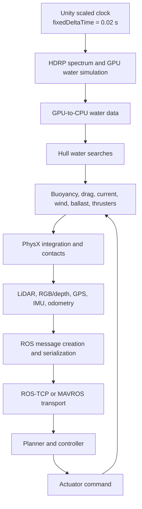

# CRANE architecture and design

This document describes the current CRANE checkout as an engineering system: its goals,
subsystems, measured findings, design principles, weaknesses, and likely next steps. Exact
benchmark commands and results live in the
[performance engineering guide](PerformanceEngineering.md). Setup and the short project overview
are in the [project README](../README.md).
Vehicle equations, coordinate/lifecycle conventions, and launch instructions are in
[SimulationPhysicsAndRuntimeModes.md](SimulationPhysicsAndRuntimeModes.md).

## Project purpose and scope

CRANE is a Unity 6 robotics simulator for testing reusable autonomous-navigation software across
vehicles and operating domains. Unity owns the world, physical interaction, and sensor
generation. ROS 2 owns the external navigation stack: mapping, estimation, planning, control,
and other model computation. A MAVROS/SITL UDP path is also available.

The intended workloads include reinforcement learning, black-box optimization, synthetic dataset
generation, regression testing, and closed-loop robotics research. These workloads require many
repeatable episodes. CRANE therefore optimizes for useful simulated seconds and completed valid
episodes per wall-clock second rather than rendered frames per second.

Aquatic physics is a central requirement. HDRP water is part of the physical model because hull
components query its displaced surface for buoyancy and hydrodynamics. Removing it would change
the experiment, not merely lower visual quality. The checked-in production scenes remain the
aquatic `Roboboat Course` and `Robosub Pool` scenes. Land now has a repeat-validated flat-ground
Ackermann dynamics fixture, and aerial has a repeat-validated analytic multirotor fixture.
Broader ground scenarios, real-platform calibration, and live aerial SITL remain incomplete.

CRANE is not yet a turnkey, fully deterministic distributed training service. It has core worker,
instrumentation, correctness, and isolation mechanisms, but live ROS validation, in-place reset,
long-duration result streaming, and broader domain fixtures still need work.

## Current capability map

| Capability | Status | Evidence or limit |
|---|---|---|
| Aquatic Rigidbody/Articulation physics and HDRP water queries | Implemented and validated | Production aquatic scenes and matched trajectory/water benchmarks |
| Graphics-free aquatic water | Blocked by current engine path | `-nographics`/batch execution does not maintain valid HDRP water readback |
| Water replay | Partial, spectral timeline validated | Recorded HDRP simulation time is pinned exactly for render/query playback; stateful foam/wakes are not checkpointed |
| RGB-off GPU depth training | Implemented and validated at 2× | Full-resolution depth is valid at 2× on the reference machine, not 4× |
| Render-independent dense depth | Absent | CPU/geometric backend still needs implementation and equivalence tests |
| Semantic detections without RGB | Implemented, weakly validated | Frustum/range/center-ray occlusion; partial visibility and correlated noise absent |
| LiDAR | Implemented and validated | Persistent native buffers plus strict Burst command generation and PointCloud2 packing; result traversal remains main-thread work |
| Authoritative replay | Experimental vertical slice | Indexed body/joint playback, accepted actions, task outcomes, v4 build provenance, and v5 observation metadata work; production reward adapters/non-regenerable sensor payloads/full-water state remain incomplete |
| ROS publishing and MAVROS UDP | Implemented, weakly validated | Local checkout lacks ROS 2/Nav2 for a real closed-loop acceptance run |
| Action provenance/lockstep control | Partial, Unity seam validated | ROS/SITL source-observation, receive, and application ticks plus sequence/episode rejection are wired; real lockstep Nav2 remains unvalidated |
| Ackermann land dynamics | Implemented and repeat-validated fixture | Flat-ground acceleration/coast/brake/turn only; production platform gaps remain |
| Multirotor dynamics | Implemented and repeat-validated fixture | Analytic checks pass; real-airframe and SITL qualification absent |
| Collision optimization | Partial, coverage validated | Classified fixture passes required/excluded pairs; production aquatic objects remain on Default |
| Episode reset | Scene reload validated; in-place absent | A→B→A scene-reload baseline passes within empirical aquatic tolerances |
| Multi-process workers | Implemented; target sensors validated through 4 workers at 2× | RGB-off depth+detection+LiDAR reaches 8.003 valid simulated s/s; 5/8-worker runs fail depth freshness; ROS processes excluded |
| Train-GPU profile | Implemented and aquatic-validated at 2× | RGB/spectators off with depth+detections+LiDAR retained; still requires graphics-backed HDRP water |
| Train-CPU profile | Implemented and land/aerial validated | Strict `-nographics` execution with zero cameras; camera depth unavailable and aquatic scenes are explicitly rejected |
| Interactive-low profile | Implemented and aquatic-validated | 960×540 spectator/window output with fixed 1280×720 robot camera targets unchanged; modest 1.97% GPU-frame reduction on the reference machine |
| Interactive/evaluation/replay high profiles | Implemented; replay aquatic-validated | Explicit full-presentation presets; replay disables live vehicle dynamics/controllers and applies authoritative state |
| Explicit/manual stepping | Absent by design | Lifecycle dependencies have not all moved behind exactly-once interfaces |

## Authoritative technology stack

Treat the versions resolved by the checkout as authoritative:

| Component | Current version or implementation |
|---|---|
| Unity Editor | `6000.5.10f1` |
| HDRP | `17.5.0` |
| Input System | `1.20.0` |
| AI Inference | `2.6.1` |
| Memory Profiler | `1.1.12` |
| ROS integration | Unity ROS-TCP Connector from its Git package |
| Robot import | Unity URDF Importer `v0.5.2` from its Git package |
| Physics | Unity PhysX through Rigidbody and ArticulationBody |

The package manifest and lock file take precedence over older metadata or setup notes. Package
changes, especially HDRP changes, can alter both performance and the physical water field and
must be rebenchmarked.

## Repository organization

The code follows Unity's component model and uses assembly definitions to separate major areas:

| Area | Main responsibilities |
|---|---|
| `Assets/Scripts/Physics` | Aquatic forces plus validated Ackermann and analytic multirotor dynamics fixtures |
| `Assets/Scripts/Actuators/Motors` | Generic motors, thrusters, ROS-driven thrusters, and configuration |
| `Assets/Scripts/Controllers` | Ackermann, full-omni, and Omni-X actuator mappings |
| `Assets/Scripts/Sensors/Lidar` | 2D laser scans and 3D point clouds |
| `Assets/Scripts/Sensors/Nav` | GPS, IMU, odometry, and MAVROS-facing navigation data |
| `Assets/Scripts/Sensors/Vision` | RGB, depth, camera info, and 3D bounding boxes |
| `Assets/Scripts/Utils` | Body adapters, forces, PID, voxelization, ROS, and MAVROS helpers |
| `Assets/Scripts/Performance` | Runtime benchmark collection and worker overrides |
| `Assets/Editor` | Worker build automation and editor utilities |
| `Tools/Performance` | Launch, comparison, summary, and scaling tools |

Vehicle behavior is assembled in scenes and prefabs by attaching these components. This is
flexible and familiar to Unity developers, but behavior is distributed across lifecycle
callbacks. That distribution is the main obstacle to a centrally controlled simulation step.

## Runtime dependency model



This is a dependency model. Unity currently determines precise callback order through its normal
frame and fixed-update lifecycle; CRANE does not expose the entire chain as one explicit
transaction. That distinction matters when interpreting timestamps or considering manual
physics stepping.

### Simulation time and stepping

The physical timestep is 0.02 simulated seconds. The accepted accelerated profile changes
`Time.timeScale`, causing Unity to process fixed steps more rapidly in wall-clock time while
keeping the physical step size unchanged. Sensor period accumulators use simulated fixed time and
retain fractional remainders, so rates such as 15 Hz do not drift when they are not integer
multiples of the physics frequency.

The code still relies heavily on `FixedUpdate()` for motors, water forces, sensor schedules,
publishers, and benchmark tick tracking. Changing to
`Physics.simulationMode = SimulationMode.Script` and calling `Physics.Simulate()` would step
PhysX, but it would not provide the required exactly-once order for those custom systems. A
manual scheduler is therefore an architectural project with explicit step interfaces, not a
one-line performance switch.

The desired future boundary is:

```text
accept action
  → prepare environment and water
  → calculate and apply forces
  → simulate PhysX once
  → acquire due sensors
  → calculate reward/state
  → publish observation and service controller callbacks
  → accept the next action
```

### Physics and vehicle abstraction

`IPhysicsBody` presents the force, torque, pose, velocity, inertia, and center-of-mass operations
needed by vehicle code. `RigidbodyAdapter` and `ArticulationBodyAdapter` allow motors and
related systems to work with either Unity body type.

Motor behavior derives from `MotorBase<TConfig>`. `GenericMotor` and `Thruster` add concrete
behavior, while configuration objects store limits and control parameters. Controllers map a
higher-level command to a vehicle's actuator layout. Current implementations cover Ackermann
steering, full omni, and Omni-X layouts.

Aquatic force models range from simple float/drag components to voxelized buoyancy and drag,
currents, and Fossen/general dynamics. These are complementary models rather than interchangeable
quality levels. A vehicle author must select and validate the model appropriate to the platform.
Combining components carelessly can apply the same physical effect twice.

The `Current` component preserves spatially varying HDRP currents: if either large- or
ripple-current support is enabled, it queries every submerged face. When both are disabled,
HDRP's returned direction is the position-invariant spectral orientation, so CRANE queries it
once per hull and physics tick and shares that result across faces. The optimization is gated by
the water-surface features rather than by a training profile and therefore cannot silently flatten
an enabled current map.

### HDRP water integration

The aquatic path has a coupled CPU/GPU pipeline:

1. HDRP advances its water spectrum and displacement simulation.
2. GPU water state becomes available to scripted CPU searches through HDRP's readback path.
3. Hull components search the displaced surface at their sample locations.
4. Buoyancy and hydrodynamic components calculate forces from the returned surface state.
5. The forces are applied before PhysX integrates the vehicle.

Some apparently visual settings are therefore physically significant. Water simulation
resolution, bands, update behavior, and CPU/GPU simulation mode can change the queried surface.
Tessellation, caustics, reflection quality, and spectator rendering are better candidates for
presentation-only changes, but each profile must prove that it leaves physical queries unchanged.

The current High Fidelity HDRP asset uses 128-resolution GPU water with readback. Enabling
full-resolution CPU water increased process CPU use from roughly 6% to 19% on the reference
machine and was rejected. The available `HDRP Performant.asset` disables water and is not a valid
aquatic training profile as configured.

The current aquatic worker needs a graphics device and a real windowed Vulkan loop.
`-nographics` and Unity `-batchmode` fail to update the water query path correctly. A CPU-only
backend should only be considered after measurements show that its engineering cost would
materially improve aggregate worker density.

HDRP 17.5 updates every `WaterSurface` from the render-pipeline water pass:
`WaterSimulationResources.Update(timeMultiplier)` advances spectral time, GPU simulation runs,
CPU simulation or GPU readback is prepared, and decal/foam state is updated. Scripted searches
then consume `WaterSimSearchData`, whose displacement buffers and `simulationTime` came from that
update. Replay therefore sets the recorded spectral time and forces the live multiplier to zero;
otherwise paused playback continues changing both rendered and queried water. Because the public
time setter silently does nothing until HDRP allocates internal simulation resources, the player
retains and reapplies the desired time on later updates. A paused two-frame fixture held the exact
recorded time and identical projected water height for nine samples over two wall seconds; a
legacy 599-frame episode advanced only through its recorded times.

Both production scenes currently disable water deformation. Roboboat enables HDRP foam, whose
GPU buffer is reprojected, attenuated, and injected over time; Robosub disables it. Spectral time
plus the static scene configuration can reconstruct the displacement field used by current hull
queries, but it cannot reconstruct Roboboat's historical foam buffer, wakes, or future
interaction effects. Those require explicit checkpoints or replayable interaction inputs.

### Sensors

`IROSSensor<T>` connects a sensor's message factory to `ROSPublisher`. Navigation and LiDAR
sensors mostly calculate data from the physical world. RGB and depth sensors additionally depend
on HDRP rendering and asynchronous GPU readback.

Depth readback keeps RGB disabled independently and preserves the `32FC1`, optical-frame,
1280×720 contract in the production fixture. With ROS transport enabled, each frame owns a
distinct managed payload because ROS-TCP queues the message for asynchronous serialization. With
transport explicitly suppressed, no asynchronous consumer retains the message, so the callback
reuses one managed payload after validating its vertically flipped bytes against the GPU request.

The Roboboat 3D LiDAR retains its authored 72,000-beam observation contract and persistent native
buffers. Its command generation, PhysX `RaycastCommand` batch, coordinate conversion, and strict
PointCloud2 packing use a measured batch size of 64. Batch size is a scheduling parameter, not an
observation-profile reduction; command, hit-classification, and payload equivalence gates cover
the production value, and a runtime override supports future hardware-specific sweeps.

Sensor rates are defined in simulated time. An observation should carry the tick at which it was
acquired, even if asynchronous processing finishes later. RGB and depth cameras use bounded
two-request queues; a full queue produces a missed observation instead of unbounded latency and
memory growth. Results carry an episode generation so callbacks from an earlier episode can be
discarded safely.

This timing policy is part of correctness. At high acceleration, a worker can advance many
physics steps while GPU readbacks lag. Reporting those images as current would produce more data
but corrupt the relationship between action and observation.

### ROS and controller boundary

`ROSPublisher` creates messages at simulated-time rates and sends them through ROS-TCP unless
`--crane-disable-ros` suppresses transport. The benchmark can therefore separate message and
sensor cost from transport cost. `ROSSubscriber` registers controller callbacks with the
connector. Clock helpers expose simulation time to ROS consumers. The MAVROS bridge provides a
separate UDP integration for SITL-style communication.

Simulation time is necessary but is not a processing barrier. An accelerated Unity worker must
not repeatedly apply an old command while the ROS controller is still computing. `ROSThruster`
and the MAVROS UDP adapter now enqueue immutable action receipts rather than mutating motors from
transport callbacks. A single-slot latest-value mailbox crosses `CraneActionGate` in
`FixedUpdate`, where episode ID, source, sequence, receive tick, application tick, duplicate
ordering, and optional maximum lag are checked before actuator mutation. Use
`--crane-action-policy latest` for interactive latest-valid behavior or
`--crane-action-policy bounded --crane-max-action-lag-ticks N` to reject commands that sat in the
Unity queue too long.

The existing Float32 ROS command and SITL PWM packet do not carry the observation tick from which
the controller computed the action. Their `actionSourceTick` is therefore deliberately `-1`, and
bounded lag falls back to receive-to-application age. This proves Unity queue freshness, not that
Nav2 consumed the newest observation. A stamped command contract plus a live ROS/Nav2 run and a
true lockstep barrier are still required for causal closed-loop acceptance.

ROS callback service is tied to Unity's normal update processing. Any future manual stepping loop
must yield often enough for the connector and main thread to process incoming work.

### Benchmark and worker architecture

`CraneBenchmarkRunner` installs before scene load when `--crane-benchmark` is present. It
collects wall and simulated time, RTF, profiler markers, process CPU, GPU frame timing, memory, GC
allocation, data-quality counters, physical samples, water samples, and sensor signatures. It
writes machine-readable JSON and marks runs invalid when required observations fail.

Stable profiler markers cover:

- simulation step
- water preparation, query, and buoyancy
- vehicle dynamics and thrusters
- LiDAR and other sensors
- ROS message creation and publishing
- episode reset

`run_worker.sh` adds external GPU and VRAM sampling. `sweep_workers.sh` gives each process its
own seed, ROS TCP port, MAVROS UDP port, output directory, and `ROS_DOMAIN_ID`. Process isolation
is the current scaling model because Unity, HDRP water, and several engine systems may hold global
state. Multiple worlds in one process should wait until multi-process scaling is fully
characterized.

## Runtime profiles and measured findings

Three runtime concepts should remain distinct:

1. **Training physics** contains the world, physical models, and sensors required by the task.
2. **Robot visual sensors** render only the RGB, depth, or related observations consumed by the
   algorithm.
3. **Presentation** contains spectator cameras, UI, recording, reflections, shadows,
   postprocessing, caustics, and other human-facing output.

The named runtime profile boundary applies to both workers and ordinary player launches.
`train-gpu` separates task sensor cameras from spectator cameras. Roboboat
uses its depth sensor camera to keep HDRP water current; an aquatic scene without a sensor camera
uses a separately classified 64×64 zero-culling water-update driver. This removes spectator
ownership, but it does not remove HDRP's graphics-device/render-loop dependency.

`train-cpu` is the strict graphics-free non-aquatic preset. It disables RGB, camera-backed depth,
camera-info, and spectator cameras while retaining physics, collision, detections, navigation
state, LiDAR, and ROS as configured. It rejects any scene containing HDRP `WaterSurface` instead
of silently disabling aquatic physics. Consequently it is useful today for land/aerial workers,
but is not yet the requested CPU depth-training architecture. `interactive-high`,
`evaluation-high`, and `replay-high` make full-presentation intent explicit; `replay-high` is the
automatic default for `--crane-replay`. Every profile can emit a resolved machine-readable report.

The `interactive-low` profile is the accepted weak-hardware presentation slice. It changes only
the spectator/window resolution (960×540 by default, configurable independently) and leaves the
robot camera RenderTextures, sensor schedules, physical water, and collision geometry unchanged.
Three matched Roboboat runs averaged 12.503 ms GPU frame time versus 12.755 ms for two
`interactive-high` runs at a 1280×720 spectator window. All runs delivered 120 RGB frames, 120
depth frames, 64 detection acquisitions, and 80 LiDAR scans over eight simulated seconds with
valid water and no stale or failed observations. Disabling a group of spectator-camera HDRP frame
settings was separately rejected because it increased GPU time by about 2.5%.

Current reference-machine results are:

| Configuration | Result | Interpretation |
|---|---:|---|
| 1280×720 RGB and depth at 15 Hz, 72,000-point LiDAR at 10 Hz | about 1.001× RTF | Accepted full-sensor profile |
| Nonvisual aquatic profile | about 4.000× RTF | Accepted candidate within measured physical variation |
| Eight nonvisual worker processes | 25.758 aggregate simulated s/s | Highest characterized aggregate throughput |
| Full visual sensors at 2× | Invalid | Missed frames and observation age fail delivery criteria |
| Train-GPU Roboboat at 2× | 2.006× RTF, valid | RGB/spectators off; depth+detections+LiDAR and water valid |
| Interactive-Low Roboboat at 1× | 12.503 ms mean GPU frame, valid | 1.97% below matched Interactive-High; task sensors unchanged |

Four nonvisual workers scaled almost linearly. At eight, aggregate throughput improved another
61%, but mean per-worker RTF fell to about 3.22× due to resource contention. Higher counts have
not been characterized.

The 60-second full-sensor stress run delivered all expected RGB, depth, and LiDAR acquisitions
with no stale or failed observations or logged errors. Memory remained close to its initial
level. Validation snapshots now stream to disk with bounded retention, but this remains
short-run evidence rather than a substitute for a multi-hour soak test.

## Improvements already implemented

Profiling and correctness work has produced the following changes:

- Persistent LiDAR native buffers and direct point packing reduced measured LiDAR time by 69.3%
  and managed allocation by 97.2%.
- `Lidar3D` direction indexing now populates every configured horizontal/vertical beam.
- Strict/high-precision Burst command generation moves the per-scan world-direction transform off
  the main thread. Two 2× target-profile runs averaged 1.904 ms/frame in the LiDAR marker versus
  3.689 ms before the change (48.4% lower); an in-process gate matched all 72,000 generated
  commands field-for-field against the original managed path.
- Strict Burst PointCloud2 packing uses persistent native point/byte buffers followed by the one
  managed copy required by the ROS message. It reduced the packing submarker by 82.5%, with all
  864,000 output bytes matching the former `BitConverter` path.
- Unity 6 `RaycastHit.colliderEntityId` replaces per-hit managed `Collider` resolution in result
  traversal. It preserved all 72,000 hit/miss classifications and reduced that submarker by 56.1%.
- Direct RGB/depth readback packing removed unnecessary texture and full-frame copy work while
  preserving message shape, vertical orientation, and acquisition time.
- Camera readbacks use bounded queues and reject failed, stale, or cross-episode results.
- Sensor schedulers retain fractional period remainder, restoring correct 10 Hz and 15 Hz rates.
- The depth camera keeps its serialized camera reference.
- `MotorBase` initializes runtime caches in `Awake()` so standalone players do not depend on
  the editor-only `OnValidate()` lifecycle.
- Camera noise shaders are explicitly available to standalone builds.
- Benchmarks emit machine-readable performance and correctness data with stable profiler markers.
- Worker launchers isolate seeds, network endpoints, ROS domains, logs, and outputs.
- A deterministic contact fixture and A→B→A scene-reload reset probe exercise physics and episode
  boundaries.

Rejected experiments are useful findings too. Manual 15 Hz camera rendering increased GPU frame
time and caused missing HDRP water-buffer warnings. Full-resolution CPU water raised CPU usage
substantially. Graphics-free execution invalidated HDRP water. Disabling spectator-camera HDRP
frame settings also raised GPU time by about 2.5%, so Interactive-Low retains those settings and
reduces only spectator resolution. These approaches should not be retried without a new
hypothesis or relevant engine/package change.

## Design principles

### Optimize valid experience, not FPS

An acceleration is useful only when trajectories, contacts, water samples, sensor values,
timestamps, rewards, and action freshness remain within defined tolerances. A worker that drops
camera frames or reuses stale commands has lower useful throughput even if it reports higher FPS.

### Measure one bounded change at a time

The standard loop is:

1. State a hypothesis tied to a measured bottleneck.
2. Record a reference with fixed scene, seed, build, and runtime arguments.
3. Make the smallest change that tests the hypothesis.
4. Repeat the benchmark and compare at equal simulated timestamps.
5. Keep the change only when its speed and fidelity effects are understood.

This makes results attributable and prevents several compensating errors from appearing correct.

### Preserve the physical model by default

Prefer eliminating duplicate work, reusing storage, batching operations, and avoiding
synchronization before changing timesteps, solver settings, water spectra, or sensor resolution.
Fidelity reductions can be valid research choices, but they require named profiles and explicit
task-specific acceptance criteria.

### Keep simulated time authoritative

Physics, sensor acquisition, ROS timestamps, rewards, and action application should refer to the
same simulated timeline. Wall time measures throughput and deadlines; rendered frames do not
define sensor frequency.

### Scope asynchronous work to an episode and tick

Every job, GPU readback, queued observation, and external action should carry enough identity to
reject results from a previous episode or obsolete tick. Queue bounds turn controller or GPU
backpressure into a visible invalid-run condition instead of hidden latency.

The process-wide authoritative simulation clock now owns episode generation on scene load and
advances exactly once per Unity fixed step, independently of benchmark warmup state. Replay v5
records observation acquisition/completion provenance and layout metadata without retaining large
sensor arrays. This closes the prior gap where ordinary, non-benchmark recordings could report a
constant metric tick. Sensor payloads are still metadata-only unless a future sensor explicitly
declares that faithful regeneration is impossible and supplies a bounded chunk payload codec.

### Separate physics, robot sensing, and presentation

Training should pay only for the physical world and observations required by the algorithm.
Presentation features belong in a separate profile. The separation must occur at explicit scene
and configuration boundaries so disabling visual effects cannot silently change water physics.

### Prefer isolated worker processes

Separate processes provide clearer ownership of Unity global state, water state, random seeds,
ROS identity, ports, logs, and failure handling. Optimize aggregate machine throughput after one
worker is correct; maximum individual-worker speed may produce lower total throughput.

### Keep abstractions narrow

Interfaces such as `IPhysicsBody`, `IROSSensor<T>`, motor configurations, and controller
mappings let new platforms reuse tested behavior. Avoid placing domain-specific policy into these
shared interfaces. Add abstractions when they remove demonstrated coupling or make correctness
testable.

## Current weaknesses and limitations

### Scheduling and lifecycle coupling

System order is implicit across `FixedUpdate()`, `Update()`, render callbacks, and asynchronous
completion callbacks. This complicates exact ordering, manual stepping, deterministic reset, and
testing systems without a scene. There is no common exactly-once step contract.

### Visual sensor throughput

Full-resolution RGB/depth readback is the largest measured sensor limitation. At 2×, each camera
completed 173 of 180 scheduled frames over 12 simulated seconds, with missed slots and up to seven
ticks of observation age. Lowering resolution or acquisition rate changes the observation model
and must be a named fidelity choice.

### Remaining LiDAR main-thread work

The optimized LiDAR still performs managed ray-direction generation, coordinate transformation,
and point packing on the main thread. This work is data parallel, but Burst/Jobs only makes sense
if an isolated prototype beats scheduling overhead and preserves hits, misses, distances,
coordinates, timing, and ROS layout.

### Per-component water searches

Hull water queries are issued by individual components instead of being grouped by water surface.
This repeats setup and prevents broad buffer reuse. Cached search hints, shared samples, and a
surface-level batch are plausible improvements, but moving queries can change convergence and
must be compared against reference water heights and vehicle trajectories.

### ROS action provenance

ROS thruster and SITL PWM actions now carry episode, source, sequence, receive tick, and
application tick through a thread-safe latest-value mailbox. A standalone synthetic fixture
validates bounded acceptance, duplicate/stale/cross-episode rejection, latest-policy behavior,
payload hold-until-apply, replacement, and rejection without actuator mutation. Float32 and SITL
packets still lack source observation ticks, and no live ROS stack was available for a closed-loop
campaign. Current results prove the Unity-side transport/application boundary only; they do not
prove accelerated planner/controller freshness.

### Reset completeness

The accepted clean reset is scene reload. It is measured and reliable, but costs more than an
in-place reset. A safe in-place reset must cover rigid bodies, actuators, water/environment state,
sensor phases and biases, random generators, ROS queues, controller/estimator state, async jobs,
GPU readbacks, and statistics. Partial reset risks cross-episode contamination.

### Collision and contact configuration

New fixtures use explicit Environment, Vehicle, DynamicObstacle, SensorQuery, and
SimulationTrigger layers. Their pruned matrix is covered by hull/dock, dynamic-obstacle,
high-speed thin-barrier, trigger, sensor-query, wheel/terrain, and aerial-landing checks. The
synthetic 144-body A/B benchmark showed no material PhysX speed change. Existing aquatic scenes
and prefabs still serialize all 805 objects on `Default`, so their interactions are preserved and
must be migrated incrementally before the matrix can reduce production broadphase work.

### Presentation ownership

Train-GPU now disables spectator cameras without breaking physical water queries. A task sensor
camera owns HDRP render updates when present; otherwise a 64×64 zero-culling fallback camera owns
water updates and is reported independently by benchmarks. This is an ownership boundary, not a
true render-independent water implementation. A 1×1 fallback was rejected because HDRP derives
zero-sized intermediate textures from that target.

### Benchmark retention and coverage

Validation samples stream incrementally to JSONL and the final result retains a configurable
bounded tail (256 by default). Whole-run invalid-water counts remain cumulative even when old
samples leave memory. A 41-sample test retained three and streamed all 41 at 2.006×. Multi-hour
stress runs are still needed, along with representative production ground/aerial scenes, a live
ROS closed loop, and worker counts beyond eight on several hardware classes.

### Determinism

Repeated aquatic runs have small millimeter-scale trajectory and water differences. Acceptance
therefore uses empirical repeatability tolerances rather than bitwise equality. Hardware, driver,
HDRP, or package changes require new repeatability baselines.

## Prioritized optimization opportunities

These categories describe expected validation risk, not guaranteed implementation effort.

### Lower risk: remove or combine unnecessary work

- Batch hull searches by HDRP water surface and use persistent input/output buffers.
- Reuse valid previous water-search locations as hints, with convergence and teleport guards.
- Share identical water samples between buoyancy, drag, and sensors within one simulation tick.
- Cache invariant spectrum, geometry, transform, and component data outside hot loops.
- Disable spectator cameras, UI, recording, and presentation effects after separating
water-update ownership.

### Authoritative replay vertical slice

`CraneEpisodeRecorder` and `CraneEpisodePlayer` provide an initial authoritative-state seam. The
recorder writes a versioned, buffered binary stream and a fixed-size sidecar seek index instead of
retaining an episode in memory. Playback disables live vehicle physics/actuator/controller
behaviours, makes bodies non-integrating, and applies exact recorded ticks without interpolation.
It exposes pause, single-tick step, playback rate, and indexed tick seek; rendering cadence does
not redefine recorded simulation time. Version 2 appends accepted control actions to frames after
successful fixed-tick actuator mutation, including source, episode, sequence, source-observation,
receive and application ticks, payload encoding, and payload bytes. The player exposes these
records for audit but does not re-run the original controller or reapply commands. Version 3 adds
task-outcome events with source, episode, per-source sequence, simulation tick, immediate and
cumulative reward, terminated/truncated state, and reason. `CraneTaskOutcome` is the narrow seam
that stamps and orders those events and rejects rewards after a source has ended its episode.
The player exposes recorded outcomes without recomputing them. Version 4 embeds a hashed build
manifest and runtime/backend metadata. The manifest contains Unity/build identity, all five built
scenes, SHA-256 entries for their 228 project-asset dependencies, and aggregate package,
project-version, and ProjectSettings hashes. Runtime metadata records platform, OS, CPU, GPU,
graphics API/driver, and the declared PhysX body backend. Playback verifies the embedded manifest
hash before applying state. It remains backward-compatible with version 1–3 recordings.
`Tools/Performance/inspect_replay.py` provides a bounded, machine-readable stream/index/action/
outcome/provenance inspection path without loading Unity.

Playback pins each HDRP surface to the recorded spectral simulation time with a zero live time
multiplier. Desired times are reapplied after HDRP resource allocation, so pause, seek, and
end-of-stream do not let the physical or rendered spectrum drift with wall/render time.

This slice is implemented and smoke-tested, not complete replay fidelity. It records rigid and
articulation body state, articulation joint positions, water simulation time, episode/tick/time,
spawn/despawn identity, accepted ROS-thruster/SITL payloads, and generic rewards/termination.
Production task adapters do not yet emit those outcome events. Replay also does not instantiate
missing spawned prefabs, record task-specific internal controller state or non-regenerable sensor
payloads, resume identical PhysX execution, or reconstruct wakes, foam, deformation, splashes, and
other stateful water/presentation history. Those remain explicit extensions to the stream rather
than assumptions about deterministic re-simulation.

- Prune collision-layer pairs after adding a collision coverage test.
- Remove remaining hot-loop component lookups and logging.
- Expand worker sweeps while monitoring CPU, GPU, VRAM, memory bandwidth, ROS, and logging I/O.

### Medium risk: change execution mechanics while preserving the model

- Move LiDAR ray generation, transforms, and packing into Burst jobs using persistent arrays;
  schedule early and complete only when a scan is required.
- Build sensor-camera scheduling that renders only on acquisition ticks while retaining the HDRP
  water resources required for physical queries.
- Test multi-rate water updates with interpolation against wave-height and trajectory tolerances.
- Introduce explicit reset interfaces and validate in-place A→B→A against scene reload and a
  fresh process.
- Define stamped ROS/SITL commands carrying the source observation tick, validate them through a
  real Nav2/SITL graph, and add a lockstep barrier for training control boundaries.
- Extend the ground fixture to slopes/curbs/suspension transients, calibrate the multirotor
  against a real platform/SITL, and add ROS-transport-only and full closed-loop scenes.

### High risk or fidelity-sensitive

- Sweep water simulation resolution, band count, sample density, and search tolerance. These can
  change the physical wave field.
- Reduce camera resolution/rate or LiDAR density only for tasks whose acceptance tests permit the
  changed observation model.
- Change timestep, solver iterations, contact settings, or sleep thresholds only with collision,
  stability, and trajectory comparisons.
- Extract a CPU-only water backend only if profiling predicts a material worker-density gain and
  the backend can match the required physical spectrum.
- Replace lifecycle scheduling with explicit manual physics stepping after every dependent system
  has an exactly-once step API and ROS callbacks remain serviceable.
- Place multiple PhysicsScenes in one process only after process scaling is understood and HDRP
  water/global-state isolation is proven.

## Adding or changing a subsystem

### Vehicle or actuator

1. Choose Rigidbody or ArticulationBody and use the existing `IPhysicsBody` adapter path.
2. Add only the needed force models; verify that overlapping components do not apply a force
   twice.
3. Express actuator limits, direction, saturation, and dynamics in a motor/thruster configuration.
4. Keep visual propeller animation separate from physical thrust state.
5. Add reference trajectories for zero input, constant input, saturation, and combined motion.

### Sensor

1. Define physical acquisition time and the output coordinate/frame convention.
2. Schedule from simulated time and retain fractional period remainder.
3. Reuse buffers and bound asynchronous work.
4. Attach episode generation and acquisition tick to deferred results.
5. Implement the ROS message through `IROSSensor<T>` and `ROSPublisher` where appropriate.
6. Validate values, misses, transforms, timestamps, message layout, and delivery rate in static
   and moving scenes.

### Controller or ROS action path

1. Keep command interpretation separate from actuator physics.
2. Record the source observation tick on the command.
3. Record the simulation tick at which the command is applied.
4. Reject or account for stale, future, duplicated, or cross-episode commands.
5. Benchmark scripted actions, trivial ROS control, and the full planning stack separately.

### Environment or water profile

1. Record the exact HDRP asset, water settings, scene, seed, and graphics backend.
2. Capture reference water samples and vehicle trajectories before changing quality settings.
3. Classify each setting as physical-water, robot-sensor, or presentation work.
4. Compare at equal simulated timestamps and retain a profile only when its fidelity is explicit.

## Reproducibility and data-quality rules

A benchmark or training run should record enough context to explain and reproduce its data:

- Unity and resolved package versions
- scene, scenario, seed, worker ID, and episode ID
- fixed timestep, time scale, physics settings, HDRP asset, and sensor configuration
- ROS domain/namespace and all TCP/UDP endpoints
- simulation, observation, action-source, and action-application ticks
- queue ages, missed/stale/failed observations, and logged errors
- RTF, marker totals, CPU/GPU utilization, memory, allocations, and reset time
- body trajectories, water samples, sensor signatures, and task rewards or objectives

Compare candidates at equal simulated time with identical seeds and configurations. Establish the
reference configuration's own run-to-run variation before setting tolerances. Mark failures in
machine-readable output and exclude invalid episodes from training data rather than allowing a
throughput average to hide them.

For asynchronous systems, an acquisition timestamp identifies when the world was observed; a
completion timestamp identifies processing delay. Both may be useful, but they are not
interchangeable.

## Near-term roadmap

The next work should follow measured cost rather than this list mechanically:

1. Batch and deduplicate water queries while preserving surface-search results.
2. Isolate and benchmark Burst/Jobs for the remaining LiDAR loops.
3. Separate presentation camera ownership from required HDRP water updates.
4. Connect ROS action provenance to controller callbacks and run live closed-loop tests.
5. Add complete reset contracts, then compare in-place reset with scene reload and a fresh process.
6. Stream validation output and run multi-hour memory and queue stress tests.
7. Extend representative ground/contact coverage and calibrate the aerial fixture against a
   production airframe and flight-controller/SITL path.
8. Extend aggregate worker scaling beyond eight and across different CPU/GPU balances.
9. Revisit an explicit scheduler only after step and reset boundaries are testable.

## Glossary

| Term | Meaning in CRANE |
|---|---|
| RTF | Simulated seconds divided by wall-clock seconds |
| Valid throughput | Experience per wall second that satisfies physics, sensor, timing, and queue criteria |
| Acquisition tick | Simulation tick at which a sensor sampled the world |
| Application tick | Simulation tick at which a controller action affected the vehicle |
| Episode generation | Monotonic ID used to reject asynchronous results from an earlier episode |
| Training physics | World and physical calculations required by an experiment |
| Robot visual sensors | Rendered observations consumed by the robot algorithm |
| Presentation | Human-facing cameras, UI, effects, and recording |
| Reference configuration | Fixed scene/build/settings/seed used to assess a candidate optimization |
