# CRANE performance engineering

This document records the measured state of the Unity `6000.5.10f1` / HDRP `17.5.0`
checkout. Repository metadata that names older releases is not authoritative.

For the broader project model, subsystem responsibilities, design principles, known limitations,
and prioritized roadmap, read [CRANE architecture and design](ArchitectureAndDesign.md). The
[project README](../README.md) provides setup instructions and a concise entry point.

## Simulation dependency map

```mermaid
flowchart LR
    C[Unity scaled simulation clock\nfixedDeltaTime = 0.02 s] --> W[HDRP water spectrum and GPU simulation]
    W --> R[GPU-to-CPU water readback]
    R --> Q[Hull water searches]
    Q --> D[Buoyancy and hydrodynamics]
    A[Thruster/controller state] --> D
    D --> P[PhysX step]
    P --> S[LiDAR, RGB/depth, IMU, odometry]
    S --> M[ROS message creation and serialization]
    M --> T[ROS-TCP / MAVROS transport]
    T --> K[Planner and controller]
    K --> A
```



The current player still uses Unity's normal fixed-update scheduler. Custom water, dynamics,
thruster, sensor, and publisher code all relies on `FixedUpdate()`. Switching directly to
`Physics.simulationMode = SimulationMode.Script` would omit or double-run those systems unless
they first move behind an explicit single-step interface.

## Authoritative settings and constraints

- Physics timestep: 0.02 simulated seconds.
- PhysX solver: 6 position iterations and 1 velocity iteration.
- Auto transform synchronization is disabled; reusable collision callbacks are enabled.
- Legacy production objects remain on `Default`, whose interactions are unchanged. New
  Environment, Vehicle, DynamicObstacle, SensorQuery, and SimulationTrigger classes use a
  coverage-tested matrix; SensorQuery has no physical pairs and triggers overlap only legacy,
  vehicle, and dynamic-obstacle bodies.
- Both aquatic scenes enable HDRP scripted water interaction.
- The High Fidelity HDRP asset uses 128-resolution water and GPU readback. Full-resolution CPU
  water increased process CPU use from about 6% to about 19% on the reference machine, so GPU
  readback remains the default.
- `HDRP Performant.asset` has water disabled and is not a valid aquatic profile without changes.
- A graphics device and a real windowed Vulkan loop are required. `-nographics` and Unity
  `-batchmode` do not drive the current HDRP water query path correctly.
- Do not change `QualitySettings.vSyncCount` at runtime in this Vulkan player; Unity 6000.5
  crashes in `GfxDeviceVK::SetVSyncCount` on the reference machine.

## Runtime profiles

`--crane-profile` is the operator-facing mode boundary and applies to ordinary players as well
as benchmark workers. The built player accepts these named presets:

For vehicle physics, project conventions, and non-benchmark launch examples, see
[SimulationPhysicsAndRuntimeModes.md](SimulationPhysicsAndRuntimeModes.md).

| Profile | Intended use | Important boundary |
|---|---|---|
| `train-gpu` | Accelerated aquatic/visual training | RGB and spectators off; depth, detections, LiDAR, ROS, and graphics-backed HDRP water remain available |
| `train-cpu` | Strict graphics-free ground/aerial or non-aquatic training | RGB/GPU depth/spectators are off; geometric depth and camera info remain; aquatic scenes are rejected until a validated CPU water backend exists |
| `interactive-low` | Nav2/parameter development on weaker hardware | Full task physics/sensors, reduced spectator/window resolution only |
| `interactive-high` | Human-operated Nav2/parameter development | Full presentation and live physics/controllers |
| `evaluation-high` | High-fidelity live evaluation | Full presentation and live physics/controllers |
| `replay-high` | High-fidelity authoritative playback | Full presentation; replay disables live vehicle physics/controllers and applies recorded state |
| `custom` | Explicit subsystem flags | No preset gates; individual `--crane-disable-*` flags apply |

Use `--crane-list-profiles` to emit the catalog and `--crane-runtime-report PATH` to write the
resolved profile, graphics backend, sensor gates, camera ownership, and aquatic status as JSON.
`--crane-replay` defaults to `replay-high` if no profile is supplied. `train-cpu` selects the
render-independent `geometric` depth backend and exits with code 3 if an aquatic scene is selected
rather than silently invalidating HDRP water physics. The geometric backend observes PhysX
colliders, not arbitrary render-only/transparent/HDRP-water surfaces.

### Training with full visual sensors

- High Fidelity HDRP water with GPU readback.
- Fixed timestep 0.02 s.
- Time scale 1 on the reference RTX 4070 Ti SUPER when both 1280×720 RGB and depth sensors run
  at 15 Hz and the 72,000-point LiDAR runs at 10 Hz.
- Train-GPU disables spectator cameras while an enabled task sensor camera, or a classified
  64×64 fallback driver, keeps HDRP water updating.
- A maximum of two asynchronous readbacks per robot camera are allowed. Every result carries its
  acquisition tick and episode generation. Full queues and failed readbacks invalidate a run.

At 2×, the bounded queue completed 173 of 180 scheduled frames per camera over 12 simulated
seconds, missed 12 total acquisition slots, and reached seven ticks of observation age. That is
not a valid full-sensor training run.

### Train-GPU: RGB-free task observations

Use `--crane-profile train-gpu` for the current graphics-backed training profile. It disables RGB
acquisition and spectator cameras independently while retaining depth, camera info, semantic
detections, LiDAR, and ROS unless an explicit gate disables one of them. In Roboboat at 2× this
profile ran at 2.006× with one sensor camera, no spectator or water-driver cameras, 149 depth
frames, 80 detection acquisitions, 100 LiDAR scans, valid water, and no stale or failed
observations during the five-wall-second regression.

HDRP still needs a rendering camera to advance aquatic water. If an aquatic scene has no enabled
task-sensor camera, Train-GPU repurposes one existing camera as a separately classified 64×64,
zero-culling water-update driver. Robosub validates this fallback with evolving queryable water,
zero spectators, and no render errors. Robosub has no configured depth/detection/LiDAR stream, so
that result validates water ownership only, not the full task-observation profile. A 1×1 target
was rejected because HDRP created zero-sized render-graph textures and logged hundreds of errors.

### Training without RGB/depth observations

Use `--crane-disable-visual-sensors`. A 4× candidate preserved aquatic body and water behavior
near the measured run-to-run floor, but this profile must be benchmarked again after each water,
physics, or sensor change. LiDAR and nonvisual sensors remain active.

### Presentation

Use the existing High Fidelity HDRP asset at time scale 1 with spectator cameras, reflections,
shadows, postprocessing, caustics, UI, and recording enabled as required. Presentation settings
must not replace the physical water asset used by scripted water queries.

Use `--crane-profile interactive-low` for the accepted weak-hardware interactive profile. It
reduces only the spectator/window resolution to 960×540 by default; robot RGB/depth RenderTextures,
sensor rates, collision geometry, and HDRP water settings are unchanged. Override the presentation
size with `--crane-interactive-width N` and `--crane-interactive-height N` (minimum 320×180).

At an incoming 1280×720 window size, three Interactive-Low Roboboat runs averaged 12.503 ms GPU
frame time, 1.97% below two matched Interactive-High runs averaging 12.755 ms. Every run delivered
120 RGB and 120 depth frames at 1280×720, 64 detection acquisitions, and 80 LiDAR scans over eight
simulated seconds, with valid water and zero stale/failed observations or logged errors. This is a
modest presentation saving, not a claim that sensor rendering or aquatic physics became cheaper.

## Benchmark invocation

Build the Linux development worker:

```bash
unity build /home/lunarz/crane_sim \
  --editor-version 6000.5.10f1 \
  --target StandaloneLinux64 \
  --execute-method CranePerformanceBuild.BuildLinuxWorker \
  --allow-dirty-build
```

Run one graphics-enabled benchmark:

```bash
SDL_VIDEODRIVER=x11 ./Builds/CRANE-Worker/CRANE.x86_64 \
  -screen-fullscreen 0 -screen-width 640 -screen-height 360 \
  -logFile "$PWD/Logs/worker.log" \
  --crane-worker --crane-benchmark --crane-disable-ros \
  --crane-scene 'Roboboat Course' --crane-scenario aquatic-full-sensor \
  --crane-seed 1000 --crane-time-scale 1 \
  --crane-warmup 3 --crane-duration 30 \
  --crane-output "$PWD/PerformanceResults/worker.json"
```

`Tools/Performance/run_worker.sh` also samples system GPU utilization with `nvidia-smi`.
`Tools/Performance/sweep_workers.sh 1 2 4 8` gives every process a distinct seed, ROS TCP port,
MAVROS UDP port, output directory, and `ROS_DOMAIN_ID`, then writes aggregate RTF summaries.
ROS-side bridge/controller processes must use the matching port and domain.

The nonvisual 4× worker sweep on the i7-12700K / RTX 4070 Ti SUPER produced:

| Workers | Valid | Aggregate simulated s/s | Mean per-worker RTF |
|---:|---:|---:|---:|
| 1 | 1/1 | 4.000 | 4.000 |
| 2 | 2/2 | 7.989 | 3.994 |
| 4 | 4/4 | 15.964 | 3.991 |
| 8 | 8/8 | 25.758 | 3.220 |

Four workers scale almost linearly. Eight workers increase aggregate throughput by another 61%
but each process falls to about 3.22×, showing CPU/GPU oversubscription. The best tested aggregate
throughput is eight workers; higher counts remain uncharacterized. Raw summaries are under
`PerformanceResults/scaling/20260917T063534Z/`.

The RGB-off target sensor profile (1280×720 depth at 15 Hz, semantic detections at 8 Hz, and
72,000-point LiDAR at 10 Hz) was separately swept with ROS transport suppressed and expensive
benchmark image hashing disabled. Every accepted worker still generated messages and retained
water/body/sensor validity checks:

| Workers × requested RTF | Valid workers | Raw aggregate s/s | Aggregate valid s/s | Stale observations | Decision |
|---:|---:|---:|---:|---:|---|
| 1 × 2 | 1/1 | 2.003 | 2.003 | 0 | Accept |
| 2 × 2 | 2/2 | 4.000 | 4.000 | 0 | Accept |
| 4 × 2 | 4/4 | 8.003 | 8.003 | 0 | Accept; highest fully valid result |
| 5 × 2 | 2/5 | 10.007 | 4.001 | 6 | Reject configuration |
| 8 × 2 | 0/8 | 16.037 | 0.000 | 834 | Reject configuration |
| 8 × 1 | 2/8 | 8.033 | 2.008 | 14 | Reject configuration |

The five-worker failure places the measured density boundary immediately above four workers on
this machine. Eight workers at 1× also fail, so the limit is concurrent visual/depth worker
density rather than requested time scale alone. These are Unity-only sensor-generation results,
not ROS/Nav2 scaling results. Raw summaries are under `PerformanceResults/target-scaling-2x/` and
`PerformanceResults/target-scaling-1x/`.

Worker summaries report raw, valid-only, and rejected aggregate throughput separately and include
`allWorkersValid`; raw RTF from workers with stale/failed observations must not be used as training
throughput.

Useful arguments:

| Argument | Meaning |
|---|---|
| `--crane-profile train-gpu` | Disable RGB and spectator rendering while retaining task sensors and ROS |
| `--crane-profile train-cpu` | Strict graphics-free non-aquatic preset; uses geometric depth and rejects aquatic scenes |
| `--crane-profile interactive-low` | Keep physics/task sensors and lower only the spectator/window resolution |
| `--crane-profile interactive-high` | Full presentation with live physics/controllers for human Nav2 development |
| `--crane-profile evaluation-high` | Full-presentation live evaluation |
| `--crane-profile replay-high` | Full-presentation authoritative playback (automatic default with `--crane-replay`) |
| `--crane-list-profiles` | Print the machine-readable profile catalog and exit |
| `--crane-runtime-report PATH` | Write the resolved runtime profile and capability state as JSON |
| `--crane-interactive-width N` | Interactive-Low window width (default 960, minimum 320) |
| `--crane-interactive-height N` | Interactive-Low window height (default 540, minimum 180) |
| `--crane-time-scale N` | Unity time scale; the physical timestep stays at 0.02 s |
| `--crane-disable-ros` | Build sensor messages but suppress ROS transport |
| `--crane-disable-visual-sensors` | Disable RGB, depth, and camera-info acquisition |
| `--crane-disable-rgb` | Disable RGB acquisition and RGB post-processing only; keep depth independent |
| `--crane-disable-depth` | Disable depth acquisition and depth post-processing only |
| `--crane-depth-backend gpu\|geometric\|off` | Select rendered, PhysX-geometric, or disabled depth independently of the profile default |
| `--crane-geometric-depth-validation` | Run null-graphics optical-Z/layout/occlusion/motion/thin-geometry checks and exit |
| `--crane-geometric-depth-fixture` | Add an obstacle-rich geometric depth stream to a complete benchmark run |
| `--crane-depth-width N`, `--crane-depth-height N`, `--crane-depth-hz N` | Configure the geometric benchmark fixture observation contract |
| `--crane-disable-camera-info` | Disable camera-info publishing only |
| `--crane-disable-detections` | Disable simulated detection publishing only |
| `--crane-record PATH` | Stream a versioned authoritative episode plus `PATH.index` |
| `--crane-record-flush-ticks N` | Flush replay chunks/index every N physics ticks (default 50) |
| `--crane-replay PATH` | Play an authoritative episode without live vehicle dynamics/controllers |
| `--crane-land-validation` | Run the standalone Ackermann dynamics checks and exit with their result |
| `--crane-aerial-validation` | Run the standalone multirotor dynamics checks and exit with their result |
| `--crane-fixture contact-heavy` | Add a deterministic 144-body contact fixture |
| `--crane-contact-fixture-legacy-layers` | Benchmark that fixture on Default instead of classified layers for matched A/B tests |
| `--crane-collision-validation` | Run matrix/contact/trigger/query coverage and exit with its result |
| `--crane-action-validation` | Run action-gate/mailbox provenance checks and exit with their result |
| `--crane-replay-outcome-validation` | Validate v3 reward/termination playback and exit with its result |
| `--crane-lidar-command-validation` | Compare one episode's Burst-generated ray commands field-for-field with the managed reference path |
| `--crane-lidar-pack-validation` | Compare one episode's Burst-packed PointCloud2 bytes with the managed `BitConverter` reference path |
| `--crane-lidar-process-validation` | Compare one episode's EntityId hit classification with managed Collider resolution |
| `--crane-lidar-batch-size N` | Override 3D LiDAR command/raycast/packing job batch size for matched sweeps |
| `--crane-depth-buffer-validation` | Compare one reused, vertically flipped depth payload byte-for-byte with its GPU readback source |
| `--crane-action-policy latest\|bounded` | Select latest-valid or bounded-lag command acceptance |
| `--crane-max-action-lag-ticks N` | Maximum receive/source-to-application lag for bounded policy |
| `--crane-ros-cmd-vel [TOPIC]` | Enable fixed-step `TwistStamped` control of the production Omni-X vehicle |
| `--crane-cmd-vel-linear-scale N` | ROS linear speed represented by normalized full command (default 1 m/s) |
| `--crane-cmd-vel-yaw-scale N` | ROS yaw rate represented by normalized full command (default 1 rad/s) |
| `--crane-command-timeout-ticks N` | Command zero after this many simulated ticks without an accepted action |
| `--crane-reset-probe` | Run scene-reload A→B→A validation before measurement |
| `--crane-no-signatures` | Skip expensive full-frame correctness hashing for throughput runs |
| `--crane-validation-period S` | Body/water snapshot interval in simulated seconds |
| `--crane-validation-capacity N` | Retain only the newest N validation samples in the final JSON (default 256) |
| `--crane-validation-output PATH` | Stream every validation sample as JSONL (defaults beside the result JSON) |
| `--crane-worker-id`, `--crane-seed` | Worker identity and deterministic random seed |
| `--crane-ros-ip`, `--crane-ros-port` | Per-process ROS-TCP endpoint |
| `--crane-mavros-port` | Per-process MAVROS UDP listen port |

Replay v5 adds a bounded observation ledger to every frame. Each entry stores stable sensor
source, topic/frame, message type, encoding, episode and sequence, acquisition and completion
tick/time, dimensions/layout, element count, byte count, and an explicit payload policy. Dense
camera/cloud bytes are not retained by the ledger, so recording does not extend their lifetime or
accumulate campaigns in memory. They are currently labeled
`metadata-only:regenerate-from-authoritative-state`; task-specific sensor payloads that cannot be
faithfully regenerated still require a future opt-in chunk payload contract. The process-wide
simulation clock advances once per Unity fixed step even when no benchmark harness is running.

Compare trajectories at equal simulated timestamps with:

```bash
python3 Tools/Performance/compare_benchmarks.py reference.json candidate.json \
  --output comparison.json
```

The result schema includes RTF, physics/water/dynamics/LiDAR/sensor/ROS markers, process CPU,
GPU frame time, memory, GC allocations, episode/tick/queue counters, errors, body states, water
samples, LiDAR hit/range signatures, and RGB/depth acquisition signatures. It also records the
validation-stream path, captured/retained/dropped counts, cumulative invalid-water count, and
whole-run maximum observation age. GPU utilization and VRAM are recorded externally by the
launcher.

## Measured changes

All short measurements below use the Roboboat scene, fixed 0.02 s physics, GPU water, and ROS
transport suppressed. They use the same 640×360 worker window unless a row states otherwise.
Raw JSON is in `PerformanceResults/`.

| Change | Before | After | Decision |
|---|---:|---:|---|
| Persistent LiDAR buffers/direct point packing, 10 s | 2991 ms LiDAR, 322.5 MB GC | 918 ms, 8.9 MB GC | Keep |
| LiDAR worst scan/frame | 45.1 ms | 13.3 ms | Keep |
| Direct camera readback packing, 6 s at 1× | 1647.8 ms sensor callback | 1456.4 ms | Keep provisionally |
| Direct camera ROS message creation | 2179.7 ms total, 28.8 ms max | 1938.6 ms total, 15.2 ms max | Keep |
| Automatic camera render → manual 15 Hz render | 12.44 ms GPU frame | 14.01 ms plus HDRP water-buffer warnings | Reverted |
| GPU water → full-resolution CPU water | about 6% process CPU | about 19% process CPU | Reverted |
| 144-body awake contact fixture at 4×, 5 s | 55.7 ms PhysX without fixture | 178.6 ms PhysX with fixture | Harness retained |
| RGB off, depth+detections on at 1×, 10 s | new target baseline | 150 depth, 100 LiDAR, 80 detection acquisitions, zero stale | Keep |
| RGB off, depth+detections on at 2×, 10 s | new accelerated target | 299 depth, 200 LiDAR, 160 detection acquisitions, zero stale | Keep |
| RGB off, depth on at 4×, 15 s | target 900 depth frames | 338 frames, 560 stale acquisitions | Reject 4× profile |
| Strip sensor-camera HDRP opaque/transparent passes at 2× | 449 depth frames, zero stale | 441 frames, 8 stale; ~2.5% lower GPU frame time | Reverted |
| Nine-ray partial-visibility detections at 2× | depth-only profile valid | 10 stale depth acquisitions | Replaced with center-ray occlusion |
| Ackermann drive torque, 60 kg rover | 110 N·m/wheel launched the body; 0 grounded wheels | 6 N·m/wheel; 4 grounded wheels and stable attitude | Keep validated setting |
| Classified 144-body contact fixture, two matched 10 s runs | 0.5837 ms/physics frame on Default | 0.5788 ms/physics frame classified | Keep for correctness; no material speed claim |
| Queued ROS/SITL action seam, standalone fixture | callbacks could mutate state off-step or lacked receipt data | all gate/mailbox cases valid; 1× aquatic target regression valid at 1.002× | Keep correctness seam; no speed claim |
| Embedded connector registration fix, live Jazzy 1× | one clock owner produced two endpoint publisher registrations | one connection, one clock registration, one registration/topic; target remained valid at 1.002× | Keep pinned package patch |
| Detection-derived ROS command loop, live Jazzy 1× | outbound transport and action seam only validated separately | 64 stamped actions accepted, zero stale/rejected; final acquire/receive/apply ticks 395/396/397; 1.003× valid | Keep causality fixture; not Nav2 qualification |
| Nav2 controller-server + LiDAR voxel costmap, live Jazzy 1× | no real Nav2 controller acceptance | terminal success; 79 measured actions accepted, zero stale/rejected/cross-episode, 0.535 m physical displacement, five costmaps with up to 2,200 occupied/inflated cells, 1.2 ms goal-to-first-command wall latency, 1.001× valid | Keep controller-level fixture; global planner/BT/localization and lockstep remain excluded |
| Nav2 NavigateToPose with NavFn + BT + LiDAR costmaps, live Jazzy 1× | controller-only fixture | terminal success; 79 measured actions accepted, zero stale/rejected/cross-episode, 0.576 m displacement, 22.4 ms goal-to-first-command wall latency, 1.001× valid | Keep full authoritative-odom loop; localization/SLAM, static map, lockstep and multi-worker scaling remain excluded |
| Aquatic scene reload + live Nav2 NavigateToPose, Jazzy 1× | clean reload validated without external controller | terminal success after `/clock` rewind; 79 actions accepted, zero stale/rejected/cross-episode; one maximum concurrent Unity connection, zero duplicate endpoint nodes/errors; 0.518 m displacement, 21.8 ms first-command latency, 1.001× valid | Accept scene reload as the ROS-connected reset baseline; in-place external reset remains partial |
| Replay v2 accepted-action stream, two 5 s runs/side at 2× | 2.0064× mean RTF, 0.596 MB GC without recording | 2.0070× mean RTF, 2.857 MB GC with recording | Keep; bounded correctness data, recorder allocation remains experimental |
| Replay water time after end-of-stream, 2 s | HDRP continued live time or setter no-op before resource allocation | exact recorded time held for 9/9 samples; invariant valid query height | Keep spectral-time pin/reapply |
| Validation stream, 2×, 5 s, 0.25 s interval, capacity 3 | unbounded in-memory validation list | 41 samples streamed, 3 retained, 38 dropped from RAM; 2.006× and valid | Keep bounded/streamed handling |
| Replay v3 task outcomes | rewards/termination absent from replay | 3 ordered events recorded, inspected, and played: reward, termination, and new-episode truncation | Keep task-outcome seam and v3 format |
| Replay v4 provenance | command-line hash and build GUID only | embedded 228-asset manifest, package/project hashes, runtime/backend metadata, and verified manifest SHA-256 | Keep; v1–v3 playback remains valid |
| Spectator HDRP frame-setting overrides, 1280×720 | 12.755 ms mean GPU frame | 13.070 ms, about 2.5% worse; correctness unchanged | Reverted |
| Interactive-Low resolution only, incoming 1280×720 | 12.755 ms mean GPU frame over 2 runs | 12.503 ms over 3 runs at 960×540; 1280×720 task sensors unchanged | Keep; modest 1.97% reduction |
| LiDAR ray-command generation, 2× target profile | 3.689 ms/frame LiDAR; 4.039 ms/frame message creation | 1.904 ms and 2.249 ms mean over 2 runs; 72,000/72,000 command fields matched | Keep strict Burst job; 48.4% LiDAR reduction |
| LiDAR PointCloud2 packing, 2× target profile | 0.567 ms/frame pack; 1.847 ms/frame LiDAR | 0.099 ms pack; 1.368 ms LiDAR mean over 2 runs; 864,000/864,000 bytes matched | Keep strict Burst job; 82.5% packing reduction |
| LiDAR EntityId hit classification, 2× target profile | 0.517 ms/frame processing; 1.368 ms/frame LiDAR | 0.227 ms processing; 1.119 ms LiDAR mean over 2 runs; 72,000/72,000 classifications matched | Keep; avoid managed Collider resolution |
| HDRP patch search batch size 1 → 8, 2× target profile | 1.0464 ms/frame water query | 1.0451 ms mean over 2 runs; correctness unchanged | Reverted; 0.13% is run variation |
| Reuse `SubmergedData.triangleAreas` in `GeneralDynamics`, 2× target profile | 1.2705 ms/frame vehicle dynamics | 1.2822 ms mean over 2 runs; trajectory stayed within measured variation | Reverted; 0.92% slower with high run variation |
| Conditional uniform-current query reuse, 2× target profile | 1.0481 ms/frame `Current`; 1.2812 ms dynamics; 1.0491 ms water query | 0.0437 ms `Current`; 0.2953 ms dynamics; 0.0644 ms water query over 2 runs | Keep when both HDRP spatial-current features are disabled |
| Depth callback attribution, 2× target profile | 0.919 ms/frame `Sensor.Other` | 0.850 ms depth readback, 0.069 ms detections, zero RGB over 2 runs | Keep submarkers; depth is the measured owner |
| Reuse managed depth payload with ROS transport suppressed, 2× target profile | 0.929 ms/frame depth callback; 0.606 ms depth publish/message | 0.258 ms callback; 0.009 ms publish mean over 2 runs | Keep conditional path; 3,686,400/3,686,400 validation bytes matched |
| Geometric depth, Null graphics, 1280×720 at 15 Hz, aerial fixture 1× | no CPU depth | 150/150 frames, zero cameras/stale/failures; 15.81 ms sensor work per acquisition; 26.50% normalized process CPU | Keep as Train-CPU backend |
| Geometric depth, Null graphics, 1280×720 at 15 Hz, aerial fixture 2× | 1× accepted run | 300/300 frames, 1.996× RTF, zero stale/failures; 15.63 ms sensor work per acquisition | Accept 2× on reference machine |
| Geometric depth, Null graphics, 1280×720 at 15 Hz, requested 4× | 2× accepted run | 454 frames over 30.30 simulated s, zero stale/failures, but only 2.908× RTF and 66.15% normalized process CPU | Reject 4× claim; CPU saturation boundary |
| Geometric replacement in production Roboboat, Vulkan 1× | authored GPU depth owned the water render loop | 76 geometric frames, 51 LiDAR scans, 41 detection acquisitions, one 64×64 water driver, zero invalid water queries/stale/failures | Keep camera-ownership fix; not graphics-free aquatic support |
| Train-CPU geometric depth worker sweep, 1280×720 at 15 Hz, requested 2× | single-worker acceptance | 1/2/4/8 workers: 1.997/3.989/4.690/4.779 aggregate valid simulated s/s; zero stale/failed observations | Keep multi-process scaling; two workers sustain 2× each, four/eight trade individual rate for density |
| Eight Train-CPU workers, requested 1× vs 2× | 4.779 aggregate at requested 2× | 4.796 aggregate at requested 1×, maximum age 3 ticks, all valid | Treat as same saturation region; prefer lower request when per-worker catch-up pressure matters |
| 72,000-ray LiDAR batch 500 → 64, 2× target profile | 0.738 ms/frame raycast; 1.003 ms full LiDAR | 0.692 ms raycast; 0.965 ms full LiDAR mean over 2 runs | Keep in production Roboboat prefab; all three equivalence gates passed |
| 72,000-ray LiDAR batch 500 → 2000, 2× target profile | 0.739 ms/frame raycast | 0.899 ms raycast | Rejected; 21.8% slower |

The independent sensor gates establish the first measured training profile with RGB disabled and
full-resolution depth plus semantic detections retained. On the reference machine it is valid at
2× but not 4×. The detection schedule now retains fractional remainder, so the scene's configured
8 Hz produces exactly 80 acquisitions in ten simulated seconds instead of about 71. Detections
use semantic registry, frustum/range checks, and a physical center-ray occlusion test without RGB;
partial visibility/noise remains future work. This is a sensor-generation baseline with ROS
transport disabled; it is not yet a Nav2 closed-loop result.

Selected machine-readable outputs for the geometric-depth acceptance runs are tracked under
`PerformanceResults/geometric-depth-*` and `PerformanceResults/train-cpu-aerial-*`. The profile's
2× acceptance point is the `train-cpu-aerial-depth-2x-final` result; the requested 4× run is kept
as negative evidence rather than reported as 4× throughput.

The sensor-costmap controller-level Nav2 evidence is tracked under
`PerformanceResults/nav2-costmap-loop-v4`; direct 50 Hz odometry/TF and cross-container TF2
lookup evidence is under `PerformanceResults/ros-nav-state-direct-tf-v1`.
The expanded planner/BT navigation evidence is under
`PerformanceResults/nav2-navigate-loop-v1`.

The CPU-depth worker sweep is tracked under
`PerformanceResults/worker-sweeps/20260918T121913Z` (1/2/4 workers requested at 2×),
`20260918T121959Z` (eight requested at 2×), and `20260918T122024Z` (eight requested at 1×).
These runs isolate Unity process scaling and explicitly exclude ROS/Nav2/bridge/SITL resource use.

LiDAR now keeps its invariant local beam table in persistent native storage and builds world-space
`RaycastCommand` entries in a strict/high-precision Burst `IJobParallelFor` chained into the
existing batched PhysX query. The accepted pair each produced 200 scans (14.4 million points),
retained full depth/detection rates, valid water, and zero stale or failed observations. The
`--crane-lidar-command-validation` gate compared all 72,000 command origins, directions, ranges,
and query parameters with the original managed construction path and found zero mismatches.
Hit traversal, local-frame conversion, checksumming, debug drawing, and PointCloud2 packing are
still synchronous main-thread work and are the next LiDAR-specific candidates.

Follow-up submarkers on the command-job implementation measured 0.760 ms/frame for strict command
generation plus batched PhysX completion, 0.567 ms/frame for PointCloud2 byte packing, and
0.520 ms/frame for hit traversal/local conversion/checksumming. Persistent native point/byte
buffers and a strict Burst packing job reduced packing to 0.099 ms/frame across two matched runs.
The complete LiDAR marker fell from 1.847 to 1.368 ms/frame (25.9%), and enclosing message creation
fell from 2.220 to 1.716 ms/frame (22.7%). Both runs retained full target observations, valid water,
and zero stale/failed observations. The validation gate matched all 864,000 bytes of one scan,
including NaN misses and the established `z,-x,y` coordinate conversion. Result traversal was the
next measured replaceable LiDAR slice; reducing ray count or bypassing PhysX is not justified.

The next bounded result change uses Unity 6's `RaycastHit.colliderEntityId` instead of resolving a
managed `Collider` for every ray. Two matched runs reduced result processing from 0.517 to
0.227 ms/frame (56.1%), the complete LiDAR marker from 1.368 to 1.119 ms/frame (18.2%), and
enclosing message creation from 1.716 to 1.481 ms/frame (13.7%). The validation path compared all
72,000 classifications with `hit.collider != null` and found zero mismatches. After this change,
the largest measured target-profile markers are message creation (1.440 ms/frame), vehicle
dynamics (1.285 ms), water queries (1.045 ms), LiDAR (1.080 ms), and other sensors (0.911 ms).

Component-level dynamics markers then showed that `Current` owned 1.048 ms/frame, about 82% of
the aggregate dynamics cost. HDRP 17.5 derives `currentDirectionWS` from the spectrum's base
orientation and only rotates it by position when a large- or ripple-current map is active. The
Roboboat surface disables both features, yet `Current` performed a complete iterative water
projection for every submerged face. The accepted path queries one face once per physics tick
only while both spatial-current features are disabled; either feature restores the original
per-face path. Across two runs this reduced `Current` by 95.8%, aggregate dynamics by 77.0%, and
water queries from 1.049 to 0.064 ms/frame. Position RMS against the matched baseline was 1.72 mm,
below the 1.94 mm baseline repeat variation; all observation rates and water checks remained valid.

Depth/RGB/detection submarkers confirmed that RGB does no callback work in Train-GPU and depth
owns about 92.5% of the remaining `Sensor.Other` time. Further depth markers separated the GPU
readback-to-managed copy, vertical row inversion, and message creation. ROS-TCP retains queued
message objects and serializes their byte arrays on its sender thread, so ROS-enabled frames still
receive distinct arrays. When transport is explicitly suppressed, the callback now reuses a
single resolution-sized managed payload: its consumer is synchronous in that mode. Two 2× runs
reduced the complete callback from 0.929 to 0.258 ms/frame (72.2%) and its publish/message slice
from 0.606 to 0.009 ms. An episode-scoped validator compared all 3,686,400 vertically remapped
bytes from one 1280×720 frame with the GPU request and found zero mismatches. The current largest
markers are ROS message creation (mostly nested LiDAR, 1.082 ms/frame), LiDAR (1.023 ms), depth
readback (0.258 ms), and vehicle dynamics (0.258 ms). This result does not reduce ROS-enabled
depth serialization or wire bandwidth.

The remaining LiDAR raycast marker combines strict Burst command generation with PhysX batched
raycasts because forcing the dependency to complete between two markers would change scheduling.
Instead, a machine-recorded batch-size sweep varied only the job partition. The production
Roboboat sensor has 72,000 beams: reducing its batch from 500 to 64 cut the raycast marker by 6.2%
and full LiDAR by 3.7% across matched repeat pairs. A batch of 2000 increased raycast time by
21.8% and was rejected. At batch 64, validation matched 72,000 command fields, 72,000 hit
classifications, and 864,000 packed bytes with zero mismatches. The owning `Blastoise.prefab` now
stores 64; the 2D sensor and other vehicle prefabs retain their authored values. The final no-
override 2× regression delivered 100 scans, 149 depth frames, and 80 detection acquisitions in
five wall seconds with valid water and no stale or failed observations.

The authoritative replay slice streams post-PhysX body poses/velocities, articulation joint
positions, water simulation time, episode/tick/time, spawn/despawn identities, accepted control
payloads, and—since format version 3—task reward and termination events. `CraneTaskOutcome.Report`
owns per-source episode stamping, sequence, cumulative reward, and terminal-state enforcement.
A focused fixture recorded exactly two accepted latest-value action payloads plus three task
outcomes: a reward, a goal termination, and a new-episode timeout truncation. Unity playback and
the bounded Python inspector both validated the outcome values and ordering. Version 4 adds a
self-contained provenance header. `CranePerformanceBuild` writes a manifest beside the player
with per-file SHA-256 values for 228 built scene dependencies plus aggregate package manifest,
package lock, project version, and ProjectSettings hashes. Recording embeds that manifest, its
SHA-256, and runtime OS/CPU/GPU/Vulkan/physics-backend metadata. The inspected 649-frame episode
had a matching 649-entry index and valid manifest hash; Unity replay retained valid water and zero
errors. Current v4 playback also passes existing v1 and v2 aquatic recordings and the v3 outcome
fixture.

A repeated matched five-wall-second 2× target-profile A/B measured 2.0064× mean RTF and 0.596 MB
GC without recording versus 2.0070× and 2.857 MB with recording. The valid repeat pair differed by
5.6 mm body-position RMS and 6.7 mm water-height RMS, within established aquatic run variation.
Recorder GC overhead therefore remains experimental and recording is not enabled by default.
Production task implementations have not yet been adapted to report through the task-outcome seam.
The stream still lacks sensor payloads that cannot be regenerated and enough water interaction
state to claim faithful wake/foam reconstruction.

HDRP water replay now pins live `timeMultiplier` to zero and reapplies the desired recorded time
after HDRP resource allocation. A two-frame end-of-stream run held the exact recorded time and
water projection across nine samples; a backward-compatible 599-frame v1 run advanced through
recorded times at playback cadence with valid queries. This validates spectral displacement timing,
not stateful foam: Roboboat's enabled HDRP foam buffer is not checkpointed.

The `Land Vehicle Validation` scene is the first representative ground-dynamics fixture. Its
60 kg four-wheel-drive rover uses WheelCollider tire/suspension contact, Ackermann inside/outside
steering, motor lag, speed limiting, braking, and rolling resistance; normal motion never assigns
the transform or rigid-body velocity. Two complete standalone runs produced identical reported
metrics: 4.0002 m/s after five seconds, 1.0115 m stopping distance from 4.0002 m/s, coast-down to
1.1683 m/s in four seconds, and a 3.2327 m measured turn radius versus the 2.5605 m analytic
Ackermann radius. All four wheels remained grounded and body up-alignment was 0.999996. Run the
machine-readable fixture with `--crane-land-validation --crane-output PATH`; evidence is in
`PerformanceResults/land-validation-repeat-{1,2}/result.json`. This validates the flat-ground
vertical slice, not slopes, curbs, suspension transients, skid steering, or omni-wheel behavior.

The `Aerial Vehicle Validation` scene adds the first multirotor dynamics vertical slice. The
1.5 kg rigid body uses four spatial rotor forces, a quadratic thrust curve, reaction torque,
motor lag, command saturation, air-relative linear/quadratic drag, angular drag, steady wind,
sinusoidal gusts, gravity, CCD, and physical landing contact. Two standalone runs again produced
identical metrics: the analytic hover command was 0.67812 with zero three-second altitude drift;
measured vertical acceleration was 3.8468 m/s² versus 3.7785 m/s² predicted; roll, pitch, and yaw
responses had the commanded sign; a 4 m/s wind plus gust displaced the body 2.4066 m; and landing
settled at the collider's 0.08 m center height. Evidence is in
`PerformanceResults/aerial-validation-repeat-{1,2}/result.json`. This is an implemented and
repeat-validated model fixture, but remains unvalidated against a named real airframe or a live
flight-controller/SITL loop; ground effect and rotor/propeller aerodynamic lookup data are absent.

Collision ownership is now explicit for new fixtures. `Collision Validation` proves
Vehicle↔Environment hull/dock contact, Vehicle↔DynamicObstacle transfer, a 40 m/s CCD thin-barrier
impact, Vehicle↔SimulationTrigger overlap, and SensorQuery ray visibility with physical
pass-through. It also verifies required and excluded matrix pairs in the built player. Land and
aerial layered regressions retained their exact prior metrics. The contact-heavy A/B benchmark
did not show a material throughput change; its two-run means differed by only 0.85%, below run
variation. Therefore this is a validated safety/classification foundation, not yet evidence that
production aquatic collision cost improved. Raw evidence is in `PerformanceResults/collision-validation/`,
`contact-ab-legacy-{1,2}/`, and `contact-ab-classified-{1,2}/`.

The direct camera path preserves the RGB8 and 32FC1 dimensions, row steps, vertical flip, and
acquisition timestamps while removing the unnecessary Texture2D upload and the depth path's
second full-frame allocation. Its aquatic trajectory comparison against the instrumented
reference was 3.1 mm position RMS, 0.061 degrees attitude RMS, and 3.0 mm sampled water-height RMS.

The 1× versus 4× high-frequency aquatic comparison measured 9.6 mm position RMS, 0.217 degrees
attitude RMS, 0.051 m/s linear-velocity RMS, and 13.6 mm water-height RMS. A repeated 1× run
already varied by 14.3 mm position RMS and 16.2 mm water-height RMS with sparse sampling, so body
and water differences did not reject 4×. Required visual-sensor delivery did reject it.

## Correctness fixes found during profiling

- `MotorBase` now initializes runtime joint/body caches in `Awake()`; `OnValidate()` alone does
  not initialize standalone players.
- `Lidar3D` now fills every horizontal/vertical beam index. The prior indexing populated only a
  fraction of the configured directions.
- Sensor period accumulators retain their fractional remainder. A configured 10 Hz LiDAR now
  produces 60 scans in six simulated seconds instead of 50, and 15 Hz cameras produce 90 frames.
- The depth camera retains its serialized camera reference instead of overwriting it with a null
  `GetComponent<Camera>()` result.
- Async camera work has a bounded queue, acquisition tick, and episode ID; callbacks from an old
  episode are discarded and no callback dereferences a destroyed camera during shutdown.
- `--crane-disable-ros` now disables the actual `Sim.Sensors.Nav.MAVROSConnection` type.
- Camera noise shaders are always included in standalone builds.
- `ROSThruster` now initializes its subscriber and both ROS thruster and SITL PWM callbacks enqueue
  latest-value action payloads. Actuator mutation occurs only after episode/sequence/lag checks in
  `FixedUpdate`; the UDP receive thread no longer writes controller state directly.
- Runtime scene selection suppresses the transient build-index-zero ROS graph. A requested scene
  opens one endpoint connection instead of two. The pinned connector patch prevents queued
  pre-handshake registrations from being sent a second time and snapshots topic state under its
  lock; the endpoint now observes one `/clock` and one registration per sensor topic.
- `ROSOmniXCommand` applies stamped planar commands only from `FixedUpdate`, converts the header
  stamp to an acquisition tick, and stops after a simulated-tick timeout. The Omni-X mixer now
  combines translation and yaw before saturation instead of discarding translation on turns.
- In-place reset now has an explicit component contract and restores body/joint state, actuator
  state, sensor acquisition phase, episode-relative clock, RNG, and HDRP spectral time. The
  graphics-free aerial fixture passed exact A→B→A restoration in 0.82 ms; broader reset state is
  still incomplete.

## Remaining bottlenecks and validation gaps

1. Full-resolution RGB/depth readback is the largest measured sensor cost and limits valid
   full-sensor execution to 1× on the reference machine. Lower resolution is a fidelity choice and
   requires task-specific validation.
2. LiDAR remains the next major CPU sensor cost after its 69% optimization. Ray-command generation
   and PointCloud2 packing now use Burst jobs; hit traversal, range summaries, and optional debug
   drawing remain main-thread work.
3. Water queries and vehicle dynamics cost roughly 190 ms and 230 ms respectively per six
   simulated seconds at 1×. Hull queries are still issued by individual components rather than
   batched by water surface.
4. Live ROS-TCP sensor transport is validated against a ROS 2 Jazzy endpoint. The matched 1×
   Roboboat run delivered 75 measured depth frames, 50 LiDAR scans, and 40 detection acquisitions
   with no stale/failed observations at 1.003× RTF. Over the full eight-second process interval,
   loopback RX and TX each increased by 507.9 MB; raw target payload is about 64 MB/s at 1×.
   This includes the bridge but excludes Nav2/controller compute.
5. A live observation-derived ROS loop now returns `TwistStamped` and validates acquisition,
   receive, and fixed-step application ticks with bounded lag. Existing Float32 and PWM protocols
   still lack source observation ticks. A real Nav2 `controller_server` FollowPath run now accepts
   79 measured commands, reaches terminal success, and moves the production ArticulationBody
   while all target sensors remain valid. The expanded `NavigateToPose` run additionally exercises
   NavFn, BT navigation, behaviors, and LiDAR-fed global/local costmaps. It uses authoritative
   odometry as the global frame; localization/SLAM, internal observation consumption, multi-worker
   scaling, and a training lockstep barrier remain unproven.
6. Scene reload remains the accepted clean reset. It now passes a live aquatic Nav2
   `NavigateToPose` run after the episode-relative `/clock` rewinds: connector teardown joins the
   old socket task, endpoint teardown removes its topic nodes, maximum concurrent Unity
   connections is one, and navigation resumes without stale/rejected/cross-episode actions. The
   in-place coordinator is validated for a non-aquatic Rigidbody/component fixture and implements
   articulation/sensor/actuator/spectral-water hooks, but it still lacks full external
   controller/ROS and stateful-water reset coverage.
7. The classified layer matrix and coverage fixture are validated, but 805 serialized production
   objects still use `Default`. Migrate ownership incrementally and benchmark representative
   aquatic contacts before claiming production collision savings.
8. Ground dynamics now have a repeat-validated flat-ground Ackermann fixture, but slope, curb,
   suspension-transient, skid/omni, and production-platform validation remain incomplete.
9. Multirotor dynamics now have a repeat-validated analytic fixture, but real-airframe parameter
   identification and flight-controller/SITL validation remain incomplete.
10. Explicit `Physics.Simulate` remains deferred until every custom `FixedUpdate()` dependency has
   a proven exactly-once step path.

The 60-second full-sensor stress run completed at 1.000× with 900 RGB frames, 900 depth frames,
600 LiDAR scans, zero stale/failed observations, and no logged errors. Mono memory ended 0.20 MB
above its first sample after reaching a transient GC peak. Total allocated memory rose 2.10 MB
(about 40.7 KB per simulated second), largely including the benchmark's growing validation list;
longer soak testing and a streaming result writer are still appropriate before unattended
multi-hour training.

The scene-reload A→B→A probe reloaded the aquatic scene in 61.3 ms, then repeated the same
three-second seed/warmup. The second A differed from the first/fresh A by 3.70 mm position RMS,
0.046 degrees attitude RMS, 0.0060 m/s linear-velocity RMS, and 8.31 mm water-height RMS. The
following five-second measurement delivered all 75 frames per camera and 50 LiDAR scans with no
stale or failed observations. Scene reload is therefore the accepted clean reset baseline; an
in-place reset cannot be accepted until equivalent coverage exists for every subsystem.

The ROS-connected reload fixture is independently recorded under
`PerformanceResults/nav2-scene-reload-v4`. It reloaded the production aquatic scene in 85.47 ms,
then recovered the real Jazzy lifecycle manager, NavFn planner, BT navigator, behavior and
controller servers. `NavigateToPose` succeeded with 79 accepted Unity actions, no
stale/rejected/cross-episode actions, 0.518 m displacement, and 21.8 ms goal-to-first-command wall
latency. The worker retained 329 depth acquisitions, 176 detection acquisitions, 220 LiDAR scans
at 72,000 points/scan, and zero invalid water searches. The endpoint observed two sequential
connections and two disconnects, at most one live connection, zero duplicate-node registrations,
and zero errors. `navigation-reset-summary.json` is the bounded acceptance record.
