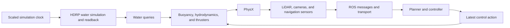

# CRANE Simulation Tool

CRANE, the **Cross-domain Robotics Autonomous Navigation Engine**, is a Unity-based robotics
simulation platform for developing navigation systems that can be reused across aerial,
underwater, ground, and surface vehicles. Unity supplies environment physics and simulated
sensors; ROS 2 supplies the planning, navigation, estimation, and control stack.

The project is currently strongest in aquatic simulation. Its production scenes use Unity
HDRP water for both the rendered environment and physical water queries used by buoyancy and
hydrodynamics. The same component model also supports land and aerial robots through reusable
physics-body, actuator, controller, sensor, and ROS abstractions.

CRANE is being developed as a research and training tool. Its performance target is **valid
simulated experience per wall-clock second**, including correct physics, sensor timing, and
controller synchronization. Frame rate alone is not a useful throughput metric.

Runtime intent is selected with a named profile rather than by changing scenes or physics code:

- `--crane-profile train-gpu`: accelerated RGB-free training with depth/detections and
  graphics-backed aquatic water.
- `--crane-profile train-cpu -nographics`: strict graphics-free non-aquatic training; aquatic
  scenes are rejected until CPU water exists, and camera depth is unavailable until geometric
  depth is implemented.
- `--crane-profile interactive-low`: full task physics/sensors with reduced presentation for
  weaker hardware and Nav2 development.
- `--crane-profile interactive-high` or `evaluation-high`: full-fidelity live operation.
- `--crane-replay episode.crane --crane-profile replay-high`: full-fidelity authoritative replay
  without re-running the original controller or vehicle physics.

Pass `--crane-list-profiles` for the machine-readable catalog or `--crane-runtime-report PATH` to
record the fully resolved settings. See `Docs/PerformanceEngineering.md` for validated commands,
constraints, and benchmark evidence.

## Capabilities

- Rigidbody and ArticulationBody vehicle support through a shared physics-body interface
- HDRP water queries, buoyancy, submersion, currents, and several hydrodynamic models
- Generic motors, configurable thrusters, ballast, and wind forces
- Ackermann, full-omnidirectional, and Omni-X controller mappings
- 2D and 3D LiDAR, RGB and depth cameras, GPS, IMU, odometry, and detection messages
- ROS-TCP publishing/subscription, simulation clock publishing, and a MAVROS/SITL UDP bridge
- URDF import through Unity's Robotics URDF Importer
- Standalone benchmark workers, correctness comparisons, reset probes, and multi-process sweeps

## Runtime architecture



The current player uses Unity's normal `FixedUpdate()` scheduler with a 0.02-second physics
timestep. Increasing `Time.timeScale` asks Unity to execute more fixed steps per wall-clock
second while keeping the physical timestep fixed. Explicit `Physics.Simulate()` is a possible
future architecture, but it is not currently safe because water, forces, sensors, publishers,
and the benchmark runner all have lifecycle dependencies that must execute exactly once per
step.

See [Simulation physics and runtime modes](Docs/SimulationPhysicsAndRuntimeModes.md) for vehicle
equations, coordinate/lifecycle conventions, authoring rules, and copyable launch commands. See
[Architecture and design](Docs/ArchitectureAndDesign.md) for the subsystem model and known
weaknesses, and [Performance engineering](Docs/PerformanceEngineering.md) for reproducible
benchmarks and fidelity measurements.

## Requirements

The checked-in project settings and resolved packages are authoritative:

- Unity `6000.5.10f1`
- High Definition Render Pipeline `17.5.0`
- A graphics device capable of running the selected HDRP backend; Vulkan is used on the tested
  Linux configuration
- A ROS endpoint when running closed-loop ROS scenarios

Repository metadata or external instructions that name an older Unity or HDRP version should
not override the locally resolved versions.

## Getting started

Clone the repository:

```bash
git clone https://github.com/1unarzDev/crane_sim
```

Install [Unity Hub](https://docs.unity3d.com/hub/manual/InstallHub.html), choose **Add project
from disk**, and select the cloned directory. Install the exact editor version listed above when
prompted. On Linux, install the required Vulkan drivers and confirm Vulkan is selected under
**Edit > Project Settings > Player > Other Settings > Graphics APIs for Linux**.

Open one of the current production scenes:

- `Assets/Scenes/Roboboat Course.unity`
- `Assets/Scenes/Robosub Pool.unity`

The repository also builds focused validation scenes for land dynamics, multirotor dynamics, and
collision coverage. These are repeatable qualification fixtures, not yet production-grade domain
environments:

- `Assets/Scenes/Land Vehicle Validation.unity`
- `Assets/Scenes/Aerial Vehicle Validation.unity`
- `Assets/Scenes/Collision Validation.unity`

For ROS operation, configure the scene's `ROSConnection` object with the address of the machine
running ROS. The [mhseals_docker repository](https://github.com/mhseals/mhseals_docker) contains
the companion ROS environment and setup notes.

URDFs can be imported from the Unity hierarchy context menu with **3D Object > URDF Model
(Import)**. Runtime code is organized under `Assets/Scripts`; start with the architecture guide
before adapting vehicle physics or sensor components.

## Runtime profiles

| Profile | Intended use | Key constraint |
|---|---|---|
| `train-gpu` | Accelerated aquatic or depth-based training | Requires a graphics-backed HDRP/Vulkan path; validated around 2× on the reference workload |
| `train-cpu` | Strict graphics-free land/aerial training | No camera depth; aquatic scenes are rejected |
| `interactive-low` | Nav2 development on weaker hardware | Reduces presentation resolution, not task physics or sensor targets |
| `interactive-high` | Human tuning and Nav2 development | Full configured presentation and live physics |
| `evaluation-high` | High-fidelity live evaluation | Full configured presentation and live controllers |
| `replay-high` | High-fidelity visualization of a recorded episode | Applies authoritative state instead of re-running control/physics |

Select a scene in a built player with `--crane-scene "Scene Name"`. Inspect available profiles
with `--crane-list-profiles`, and write the resolved configuration with
`--crane-runtime-report PATH`. Full commands and precise headless terminology are in the
[physics and modes guide](Docs/SimulationPhysicsAndRuntimeModes.md).

Eight legacy nonvisual aquatic workers reached about 25.758 aggregate simulated seconds per wall
second. The current target Train-GPU workload with depth, detections, and LiDAR reached 8.003
aggregate valid simulated seconds/second across four 2× workers. These measurements are hardware-
and-scene-specific baselines, not universal guarantees.

## Current maturity

CRANE has automated standalone benchmarks, subsystem profiler markers, sensor delivery checks,
worker isolation, and an accepted scene-reload reset baseline. Profiling has already reduced
LiDAR time by 69.3% and its managed allocation by 97.2% in the measured scenario.

Important limitations remain: full-resolution camera readback caps full-sensor acceleration;
graphics-free dense depth and aquatic water are absent; water queries are issued component by
component; real ROS/Nav2 lockstep has not been validated locally; in-place reset coverage is
incomplete; and the land/aerial scenes are qualification fixtures rather than production
environments. Read the documentation before treating a run as training-valid.

## Repository map

| Path | Purpose |
|---|---|
| `Assets/Scenes` | Production aquatic environments |
| `Assets/Scripts/Physics` | Water, wind, ballast, submersion, and vehicle dynamics |
| `Assets/Scripts/Actuators` | Motor and thruster models |
| `Assets/Scripts/Controllers` | Vehicle command-to-actuator mappings |
| `Assets/Scripts/Sensors` | LiDAR, navigation, and vision sensors |
| `Assets/Scripts/Utils/ROS` | ROS clock, publishers, and subscribers |
| `Assets/Scripts/Performance` | Standalone benchmark and worker configuration |
| `Assets/Editor/CranePerformanceBuild.cs` | Reproducible worker build entry point |
| `Tools/Performance` | Launch, compare, summarize, and worker-sweep tools |
| `PerformanceResults` | Recorded benchmark artifacts |
| `Docs` | Architecture and performance documentation |

## Documentation

- [Architecture and design](Docs/ArchitectureAndDesign.md)
- [Simulation physics, conventions, and runtime modes](Docs/SimulationPhysicsAndRuntimeModes.md)
- [Performance engineering and benchmark results](Docs/PerformanceEngineering.md)
