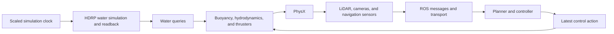

# CRANE Simulation Tool

CRANE, the **Cross-domain Robotics Autonomous Navigation Engine**, is a Unity-based robotics
simulation platform for developing navigation systems that can be reused across aerial,
underwater, ground, and surface vehicles. Unity supplies environment physics and simulated
sensors; ROS 2 supplies the planning, navigation, estimation, and control stack.

The project is currently strongest in aquatic simulation. Its production scenes use Unity
HDRP water for both the rendered environment and physical water queries used by buoyancy and
hydrodynamics. The same component model also supports land and aerial robots through reusable
physics-body, actuator, controller, sensor, and ROS abstractions.

CRANE is being developed as a research and training tool. Its performance target is **valid
simulated experience per wall-clock second**, including correct physics, sensor timing, and
controller synchronization. Frame rate alone is not a useful throughput metric.

Runtime intent is selected with a named profile rather than by changing scenes or physics code:

- `--crane-profile train-gpu`: accelerated RGB-free training with depth/detections and
  graphics-backed aquatic water.
- `--crane-profile train-cpu -nographics`: strict graphics-free non-aquatic training; aquatic
  scenes are rejected until CPU water exists, while `32FC1` depth uses batched PhysX geometry
  instead of rendering.
- `--crane-profile interactive-low`: full task physics/sensors with reduced presentation for
  weaker hardware and Nav2 development.
- `--crane-profile interactive-high` or `evaluation-high`: full-fidelity live operation.
- `--crane-replay episode.crane --crane-profile replay-high`: full-fidelity authoritative replay
  without re-running the original controller or vehicle physics.

Pass `--crane-list-profiles` for the machine-readable catalog or `--crane-runtime-report PATH` to
record the fully resolved settings. See `Docs/PerformanceEngineering.md` for validated commands,
constraints, and benchmark evidence.

## Capabilities

- Rigidbody and ArticulationBody vehicle support through a shared physics-body interface
- HDRP water queries, buoyancy, submersion, currents, and several hydrodynamic models
- Generic motors, configurable thrusters, ballast, and wind forces
- Ackermann, full-omnidirectional, and Omni-X controller mappings
- 2D and 3D LiDAR, RGB and depth cameras, GPS, IMU, odometry, and detection messages
- ROS-TCP publishing/subscription, simulation clock and authoritative odometry/TF publication,
  fixed-step stamped `cmd_vel` application, and an ArduPilot JSON/SITL UDP bridge (legacy class
  name `MAVROSConnection`)
- URDF import through Unity's Robotics URDF Importer
- Standalone benchmark workers, correctness comparisons, scene-reload and in-place reset probes,
  and multi-process sweeps

## Runtime architecture



The current player uses Unity's normal `FixedUpdate()` scheduler with a 0.02-second physics
timestep. Increasing `Time.timeScale` asks Unity to execute more fixed steps per wall-clock
second while keeping the physical timestep fixed. Explicit `Physics.Simulate()` is a possible
future architecture, but it is not currently safe because water, forces, sensors, publishers,
and the benchmark runner all have lifecycle dependencies that must execute exactly once per
step.

See [Simulation physics and runtime modes](Docs/SimulationPhysicsAndRuntimeModes.md) for vehicle
equations, coordinate/lifecycle conventions, authoring rules, and copyable launch commands. See
[Architecture and design](Docs/ArchitectureAndDesign.md) for the subsystem model and known
weaknesses, and [Performance engineering](Docs/PerformanceEngineering.md) for reproducible
benchmarks and fidelity measurements.

## Requirements

The checked-in project settings and resolved packages are authoritative:

- Unity `6000.5.10f1`
- High Definition Render Pipeline `17.5.0`
- A graphics device capable of running the selected HDRP backend; Vulkan is used on the tested
  Linux configuration
- A ROS endpoint when running closed-loop ROS scenarios

Repository metadata or external instructions that name an older Unity or HDRP version should
not override the locally resolved versions.

## Getting started

Clone the repository:

```bash
git clone https://github.com/1unarzDev/crane_ml.git
```

Install [Unity Hub](https://docs.unity3d.com/hub/manual/InstallHub.html), choose **Add project
from disk**, and select the cloned directory. Install the exact editor version listed above when
prompted. On Linux, install the required Vulkan drivers and confirm Vulkan is selected under
**Edit > Project Settings > Player > Other Settings > Graphics APIs for Linux**.

Open one of the current production scenes:

- `Assets/Scenes/Roboboat Course.unity`
- `Assets/Scenes/Robosub Pool.unity`

The repository also builds focused validation scenes for land dynamics, multirotor dynamics, and
collision coverage. These are repeatable qualification fixtures, not yet production-grade domain
environments:

- `Assets/Scenes/Land Vehicle Validation.unity`
- `Assets/Scenes/TurtleBot3 Warehouse Validation.unity`
- `Assets/Scenes/Aerial Vehicle Validation.unity`
- `Assets/Scenes/PX4 Walls Validation.unity`
- `Assets/Scenes/PX4 ArUco Validation.unity`
- `Assets/Scenes/PX4 Windy Validation.unity`
- `Assets/Scenes/Collision Validation.unity`

External SDF reference worlds are converted offline into Git-ignored generated assets; they are
not runtime-loaded. See [Reference environments](Docs/ReferenceEnvironments.md) for the pinned
Clearpath pipeline and F1TENTH occupancy-map procedures and their validation limits.

For ROS operation, configure the scene's `ROSConnection` object with the address of the machine
running ROS. The [mhseals_docker repository](https://github.com/mhseals/mhseals_docker) contains
the ROS 2 Jazzy image and endpoint setup notes. Its navigation packages are separate optional
repositories, not part of this checkout. CRANE has a live ROS-TCP sensor-transport acceptance
run; the current `mhseals_nav` launch still assumes RGB/RTAB-Map and MAVROS, so a depth-only Nav2
project-specific localization/SLAM acceptance remains outstanding. A real Jazzy Nav2
`NavigateToPose` loop is validated with CRANE odometry/TF, LiDAR-populated voxel costmaps, NavFn
global planning, BT navigation, behavior and controller servers, and returned commands. The
bounded fixture uses authoritative Unity odometry as its global frame, so it intentionally does
not claim localization, static-map navigation, or training lockstep. Multi-worker Nav2 density is
validated separately with isolated domains and ports.

URDFs can be imported from the Unity hierarchy context menu with **3D Object > URDF Model
(Import)**. Runtime code is organized under `Assets/Scripts`; start with the architecture guide
before adapting vehicle physics or sensor components.

## Runtime profiles

| Profile | Intended use | Key constraint |
|---|---|---|
| `train-gpu` | Accelerated aquatic or depth-based training | Requires a graphics-backed HDRP/Vulkan path; validated around 2× on the reference workload |
| `train-cpu` | Strict graphics-free land/aerial training | Geometric depth sees physical colliders; aquatic scenes are rejected |
| `interactive-low` | Nav2 development on weaker hardware | Reduces presentation resolution, not task physics or sensor targets |
| `interactive-high` | Human tuning and Nav2 development | Full configured presentation and live physics |
| `evaluation-high` | High-fidelity live evaluation | Full configured presentation and live controllers |
| `replay-high` | High-fidelity visualization of a recorded episode | Applies authoritative state instead of re-running control/physics |

Select a scene in a built player with `--crane-scene "Scene Name"`. Inspect available profiles
with `--crane-list-profiles`, and write the resolved configuration with
`--crane-runtime-report PATH`. Full commands and precise headless terminology are in the
[physics and modes guide](Docs/SimulationPhysicsAndRuntimeModes.md).

Eight legacy nonvisual aquatic workers reached about 25.758 aggregate simulated seconds per wall
second. The current target Train-GPU workload with depth, detections, and LiDAR reached 8.003
aggregate valid simulated seconds/second across four 2× workers. These measurements are hardware-
and-scene-specific baselines, not universal guarantees.

For strict Train-CPU with 1280×720 geometric depth at 15 Hz, 1/2/4/8 Unity workers requested at
2× reached 1.997/3.989/4.690/4.779 aggregate valid simulated seconds/second. Eight workers
requested at 1× reached 4.796, statistically the same saturation region; each worker ran below
real time. These CPU sweeps exclude ROS/Nav2 processes and should not be generalized to a closed
loop deployment.

Closed-loop scaling has a separate measured envelope because every worker also owns a ROS-TCP
endpoint and a real Nav2 planner/BT/costmap/controller graph. Two 1× workers passed at 2.002×
aggregate measured RTF. Four 1× workers reached 4.006× but had one stale-action outlier across two
runs. One 2× worker and two concurrent 2× workers also passed, the latter totaling 4.003×
measured RTF with both `NavigateToPose` goals successful. Three-worker trials at 1.5× and 2×
were rejected for stale depth observations. The current highest accepted density point is six
workers at 0.75×, totaling 4.509× measured RTF; eight-worker runs were likewise rejected for
stale depth observations. These are reference-machine results, not default settings for other
hardware.

## Current maturity

CRANE has automated standalone benchmarks, subsystem profiler markers, sensor delivery checks,
worker isolation, an accepted scene-reload reset baseline, and an experimental in-place reset
coordinator. Profiling has already reduced LiDAR time by 69.3% and its managed allocation by
97.2% in the original measured scenario; subsequent strict Burst return processing cut the
then-current LiDAR result loop by another 47.0% while preserving every packed byte. The accepted
aquatic scene-reload path is also exercised through
a live Jazzy Nav2 `NavigateToPose` run: the endpoint closes the old scene connection, removes its
topic nodes, accepts exactly one replacement connection, handles the `/clock` rewind, and resumes
navigation without stale or cross-episode actions. This does not promote the experimental in-place
reset path or imply that external localization/SLAM state has a reset contract.

Accelerated closed-loop results include action-age telemetry, not only goal status. In the accepted
single-worker 2× run, all 40 applied actions carried odometry provenance; mean/maximum
observation-to-application age was 4.175/7 fixed ticks, receive-to-application age was one tick,
and one command watchdog stop was recorded after the goal completed. The fixture rejects runs
whose stamped actions exceed their configured lag bound or lose provenance.

The aquatic ArduPilot JSON UDP protocol also has a 2× loopback acceptance fixture: 200 valid
servo packets and one deliberately malformed packet were accounted for, 198 latest-value actions
were applied with a one-tick maximum queue age, and 653 telemetry packets advanced at 1.999×
simulated time while the Unity worker sustained 2.003× RTF. The aerial direct-PWM variant accepted
200/200 valid packets, rejected one malformed packet, returned 782 peer-visible telemetry packets
at 1.997× simulated time, moved the reference quadrotor upward 2.768 m, and sustained 2.000× RTF
under null graphics. Channels 0–3 map to front-left, front-right, rear-right, rear-left and enter
the same fixed-step action gate as other external commands. These are protocol-to-plant fixtures,
not real ArduPilot/PX4 or flight-controller qualification. ROS-TCP and SITL can be gated
independently with `--crane-disable-ros-tcp` and `--crane-disable-sitl`; the legacy
`--crane-disable-ros` switch disables both.

Important limitations remain: full-resolution camera readback caps GPU-sensor acceleration;
graphics-free aquatic water is absent; geometric CPU depth does not model render-only surfaces;
water queries are issued component by component; production aquatic colliders now have explicit
Vehicle/Environment/DynamicObstacle/SimulationTrigger ownership, but matched measurements did not
show a collision-speed improvement; live ROS-TCP transport and stamped returned
actions and a real Nav2 planner/BT/controller plus LiDAR costmap loop are validated, but
localization/SLAM and Nav2 lockstep are not; in-place reset does not yet cover every controller, external ROS state, or
stateful water effect; and the land/aerial scenes are qualification fixtures rather than production
environments. Read the documentation before treating a run as training-valid.

## Repository map

| Path | Purpose |
|---|---|
| `Assets/Scenes` | Production aquatic environments |
| `Assets/Scripts/Physics` | Water, wind, ballast, submersion, and vehicle dynamics |
| `Assets/Scripts/Actuators` | Motor and thruster models |
| `Assets/Scripts/Controllers` | Vehicle command-to-actuator mappings |
| `Assets/Scripts/Sensors` | LiDAR, navigation, and vision sensors |
| `Assets/Scripts/Utils/ROS` | ROS clock, publishers, and subscribers |
| `Assets/Scripts/Performance` | Standalone benchmark and worker configuration |
| `Assets/Editor/CranePerformanceBuild.cs` | Reproducible worker build entry point |
| `Tools/Performance` | Launch, compare, summarize, and worker-sweep tools |
| `PerformanceResults` | Recorded benchmark artifacts |
| `Docs` | Architecture and performance documentation |

## Documentation

- [Architecture and design](Docs/ArchitectureAndDesign.md)
- [Simulation physics, conventions, and runtime modes](Docs/SimulationPhysicsAndRuntimeModes.md)
- [Performance engineering and benchmark results](Docs/PerformanceEngineering.md)
